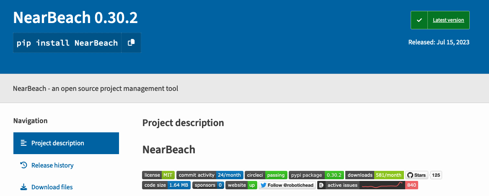

# NearBeach Docker Setup

The following repository is meant to;
- House the code for the docker files
- Automatically build the base docker setup for NearBeach
- Automatically build the main docker application


## NearBeach Base

File: Dockerfile.base

Contains the base installation and libraries required for NearBeach application to run. This dockerfile is scheduled to be built on;
- Monday
- Wednesday
- Friday

Any library updates are built into the new build - which is then used automatically for the NearBeach application when a new release is scheduled.


## NearBeach

File: Dockerfile

This is the NearBeach application. It uses the base to install NearBeach.


## Docker Image

File: docker-image.yml

Github actions file - designed to be triggered when there is a new release. Anytime the main branch of this repository has a commit/pull request. This action file automatically triggers. The trigger will rebuild NearBeach's dockerfile and publish to Dockerhub.


# Manually Triggering New Releases

1. Make sure the latest NearBeach version has been publish to PyPi with the 
correct versions


2. Edit this current repository - open up the file "~/.github/workflows/docker-image.yml"
3. Update the two places where the version number is

4. Push the code - with a detail commit message. i.e. `update NearBeach version to 0.30.2`

The Github actions will automatically trigger, start building the docker application, and deploy it to docker hub.

### Notes

---

It might be best to set this up in the future so it is a manual trigger. Where it'll get the version number from a github actions variable. https://docs.github.com/en/actions/learn-github-actions/variables

---

It might also be best to actually condense the docker file, we can have multiple tags in a single build. i.e. from the Docker documentation

`docker build -t whenry/fedora-jboss:latest -t whenry/fedora-jboss:v2.1 .`

Is that possible to do with the following code

```
name: Build and push latest
uses: docker/build-push-action@v6
with:
    context: .
    file: ./Dockerfile
    push: true
    #platforms: linux/arm64,linux/amd64,linux/amd64/v2,linux/ppc64le,linux/s390x,linux/arm/v7,linux/arm/v6
    platforms: linux/arm64,linux/amd64
    tags: ${{ secrets.DOCKER_HUB_USERNAME }}/nearbeach:latest
```

# Build locally for testing

Use the following code to create a local build for NearBeach

1. Using a terminal, `cd` into this directory
2. Run the following command `docker build --no-cache --file Dockerfile --tag robotichead/nearbeach:nearbeach-local . `
3. Use the docker-compose example on https://nearbeach.org/self-hosting/ - modify the image to the match the build name. i.e. `image: robotichead/nearbeach:nearbeach-local`
4. Using `docker compose up -D` you can easily test the local docker build of NearBeach 
